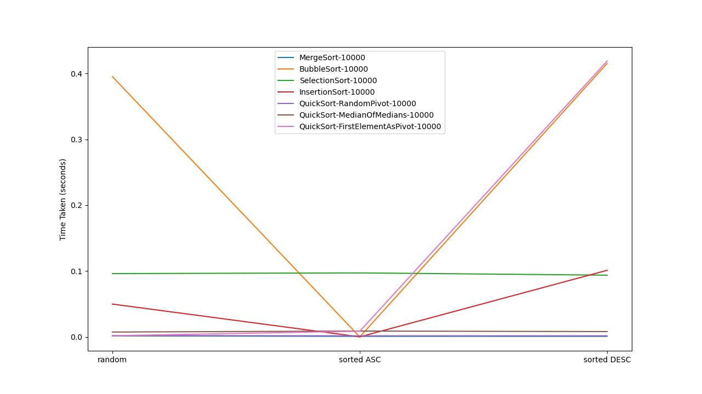

## How to run
- **Docker**: if you have docker on your machine run

```sh
    make run-docker 
```

- **Ubuntu 22.04**
```sh
    make setup-ubuntu-focal # installs g++ python3 and python3-matplotlib packages
    make                    # compile
    make run                # generates the plot
```

## Sorting Algorithm Time Complexities




### Bubble Sort

- **Best Case**: Occurs when the input array is already sorted. In this case, the algorithm only requires a single pass to determine that no swaps are needed.
- **Worst Case**: Occurs when the input array is in reverse order. This results in the maximum number of comparisons and swaps in each pass.
- **Average Case**: Occurs when the input data is random or partially sorted, resulting in an average number of comparisons and swaps.

### Selection Sort

- **Best Case**: There is no distinction in the number of comparisons, regardless of the input data. The best and worst cases are the same.
- **Worst Case**: Occurs when the input data is random, partially sorted, or in reverse order. Selection sort always performs the same number of comparisons, leading to a time complexity of O(n^2).
- **Average Case**: Same as the worst case since it always performs the same number of comparisons.

### Insertion Sort

- **Best Case**: Occurs when the input array is already sorted, requiring minimal comparisons and no swaps.
- **Worst Case**: Occurs when the input array is in reverse order, resulting in the maximum number of comparisons and swaps in each pass.
- **Average Case**: Occurs when the input data is random or partially sorted, leading to an average number of comparisons and swaps.

### Quick Sort

- **Best Case**: Occurs when the pivot choices consistently divide the input into nearly equal partitions, resulting in O(n log n) time complexity.
- **Worst Case**: Occurs when the pivot choices result in highly unbalanced partitions, such as always picking the smallest or largest element as the pivot. This leads to a time complexity of O(n^2).
- **Average Case**: Occurs when the pivot choices are relatively balanced, leading to an average time complexity of O(n log n).

### Merge Sort

- **Best Case**: Occurs when the input data is randomly distributed, and the merge operations consistently divide the data evenly. This results in O(n log n) time complexity.
- **Worst Case**: Occurs when the input data is already sorted in reverse order. Merge sort will still require O(n log n) comparisons and merges.
- **Average Case**: Occurs when the input data is random or partially sorted, leading to an average time complexity of O(n log n).

In practical applications, the best, worst, and average cases for sorting algorithms depend on various factors, such as the specific implementation and the characteristics of the input data.